# DesignGuard — Architecture & Algorithms

> Internal reference for algorithms, analysis engines, data flow, and system design.
> For getting started and contributing, see [README.md](README.md) and [CONTRIBUTING.md](CONTRIBUTING.md).

---

## Table of Contents

1. [System Overview](#1-system-overview)
2. [File Parsing & Format Support](#2-file-parsing--format-support)
3. [Unified Circuit Schema (UCS)](#3-unified-circuit-schema-ucs)
4. [Design Rule Checking (DRC)](#4-design-rule-checking-drc)
5. [Decoupling Risk Scoring (DRS)](#5-decoupling-risk-scoring-drs)
6. [Capacitor Classification](#6-capacitor-classification)
7. [Voltage Propagation](#7-voltage-propagation)
8. [PCB Compliance](#8-pcb-compliance)
9. [EMI Analysis](#9-emi-analysis)
10. [Datasheet Compliance](#10-datasheet-compliance)
11. [AI Integration](#11-ai-integration)
12. [Frontend Features](#12-frontend-features)
13. [Infrastructure](#13-infrastructure)
14. [Coverage Matrix](#14-coverage-matrix)
15. [Known Limitations & Not Covered](#15-known-limitations--not-covered)

---

## 1. System Overview

DesignGuard is a Tauri-based desktop application that analyses KiCad schematics and
PCB layouts for electrical, compliance, and signal-integrity issues. The backend is
written in Rust; the frontend uses React/TypeScript.

```
┌──────────────────────────────────────────────────────────┐
│  Frontend (React / TypeScript)                           │
│  Panels: Issues · DRS · Roles · Compliance · Circuit     │
│  Chat · AI Analysis · Settings                           │
└────────────────────────┬─────────────────────────────────┘
                         │ Tauri IPC (60+ commands)
┌────────────────────────▼─────────────────────────────────┐
│  Backend (Rust)                                          │
│  ┌─────────┐ ┌──────────┐ ┌────────────┐ ┌───────────┐  │
│  │ Parsers │ │ Analyzer │ │ Compliance │ │    AI     │  │
│  │ (KiCad  │ │ (DRC,DRS │ │ (IPC-2221  │ │ (Claude,  │  │
│  │  4–9)   │ │  CapCls) │ │  EMI,Rules)│ │  Ollama)  │  │
│  └────┬────┘ └────┬─────┘ └─────┬──────┘ └─────┬─────┘  │
│       │           │             │               │        │
│  ┌────▼───────────▼─────────────▼───────────────▼─────┐  │
│  │  Unified Circuit Schema (UCS) / Circuit Graph      │  │
│  │  petgraph DiGraph  ·  Voltage Propagation          │  │
│  └────────────────────────────────────────────────────┘  │
│  ┌────────────────┐  ┌───────────────┐                   │
│  │  Datasheets    │  │  Database     │                   │
│  │  (built-in +   │  │  (SQLite)     │                   │
│  │   user JSON)   │  │               │                   │
│  └────────────────┘  └───────────────┘                   │
└──────────────────────────────────────────────────────────┘
```

---

## 2. File Parsing & Format Support

### 2.1 Format Detection (`format_detector.rs`)

| Algorithm | Description |
|-----------|-------------|
| Header sniffing | Reads first bytes to distinguish `EESchema`, `PCBNEW`, `(kicad_sch`, `(kicad_pcb` |
| Version extraction | Parses S-expression `(version YYYYMMDD)` date codes to determine KiCad 6/7/8/9 |
| Router | Dispatches to the correct parser based on detected format |

### 2.2 Supported Formats

| Format | Extension | Parser | Status |
|--------|-----------|--------|--------|
| KiCad 4-5 Legacy Schematic | `.sch` | `kicad_legacy.rs` | **Covered** |
| KiCad 4-5 Legacy PCB | `.brd` | `kicad_legacy.rs` | **Covered** |
| KiCad 6-9 Schematic | `.kicad_sch` | `kicad.rs` | **Covered** |
| KiCad 6-9 PCB | `.kicad_pcb` | `pcb.rs` | **Covered** |
| KiCad Project | `.kicad_pro` | File watcher only | Metadata only |
| Altium SchDoc | — | — | **Not covered** |
| Eagle `.sch` / `.brd` | — | — | **Not covered** |
| Generic netlist (EDIF) | — | — | **Not covered** |

### 2.3 S-Expression Parser (`sexp.rs`)

- Recursive-descent parser for KiCad's S-expression format.
- Handles quoted strings with escape sequences, nested lists, atoms.
- Used by both modern schematic and PCB parsers.

### 2.4 Legacy PCB Parser (`kicad_legacy.rs` — parse_legacy_pcb)

Line-based block state machine following the PCBNEW text format:


| Block | Output | What's Parsed |
|-------|--------|---------------|
| `$GENERAL` | `PcbGeneral` | Board thickness, item counts |
| `$SETUP` | `PcbSetup` | Trace min, via size/drill, clearance, copper weight |
| `$EQUIPOT` | `Vec<PcbNet>` | Net ID + name |
| `$MODULE` | `Vec<Footprint>` | Position, reference, value, library, nested `$PAD` blocks |
| `$PAD` | `Vec<Pad>` | Shape (C/R/O/T), type (STD/SMD/CONN/HOLE), drill, size, net, layers |
| `$TRACK` | `Vec<Trace>` + `Vec<Via>` | Po/De line pairs; shape 0 = trace, shape 1 = via |
| `$ZONE` | `Vec<Zone>` | Outline corners, fill polygons, net, priority |
| `$DRAWSEGMENT` | `Vec<GraphicItem>` | Line, rect, arc, circle |

**Coordinate handling:** Auto-detects unit factor from `InternalUnit` line; defaults to
decimils (0.0001 inch = 0.00254 mm). Post-processing resolves net names from `$EQUIPOT`
IDs onto traces, vias, and pads.

### 2.5 Geometric Netlist Builder (`netlist.rs`)

Builds pin-to-net connectivity from schematic geometry:

1. Converts wires to line segments
2. Groups connected segments using union-find
3. Assigns net names from global/hierarchical labels
4. Maps component pins to nets via geometric proximity (nearest wire segment)


**Limitation:** Pin positions use default spacing assumptions; full accuracy requires
KiCad symbol library data (not currently loaded).

---

## 3. Unified Circuit Schema (UCS)

### 3.1 Data Model (`schema.rs`)

CAD-agnostic graph representation of a circuit:

- **`UcsComponent`** — ref_des, value, MPN, footprint, pins, position, attributes
- **`UcsNet`** — net name, voltage level, signal type, connections, is_power_rail
- **`UcsPin`** — number, name, electrical type, connected net
- **Component type inference** — `ComponentType::from_ref_des()` maps R→Resistor, C→Capacitor, U→IC, etc.
- **Signal type inference** — `SignalType::from_net_name()` classifies GND, VCC, CLK, SDA, etc.

#### Data flow: KiCad files to Circuit Graph


### 3.2 Circuit Graph (`circuit.rs`)

Uses `petgraph::DiGraph` with bipartite nodes:

- **Component nodes** (`CircuitNode::Component`)
- **Net nodes** (`CircuitNode::Net`)
- **Edges** (`CircuitEdge`) represent pin connections (pin number + name)

#### Bipartite Graph Structure

The graph alternates between two node types. Components never connect directly
to other components; nets never connect directly to other nets. Every edge
crosses the type boundary through a pin.


Each edge carries a `CircuitEdge` struct:

```
CircuitEdge {
    pin_number: "VDD",       // e.g. "1", "A1", "VDD"
    pin_name:   Some("VDD"), // human-readable name
}
```

#### Graph Traversal Patterns


Key algorithms:

| Algorithm | Purpose |
|-----------|---------|
| `from_ucs()` / `to_ucs()` | Round-trip conversion between UCS and graph |
| `propagate_voltages()` | Seeds known voltages from regulator/power-symbol detection |
| `find_voltage_sources_pub()` | Identifies regulators (78xx, AMS1117, TLV1117, AP2112, MCP1700, RT9080, etc.) |
| `find_path()` | A* shortest path between two components |
| `components_near()` | Euclidean spatial proximity search |
| `create_ai_slice()` | Filtered subgraph for AI context windows |

#### A* Path Finding

`find_path(from, to)` uses the petgraph A* algorithm to find the shortest
hop-path between two component nodes, traversing through net nodes:


Path result: `["R1", "[NET1]", "C1", "[GND]", "U1"]`

### 3.3 KiCad Adapter (`adapters/kicad.rs`)

Converts parsed KiCad `Schematic` into `UnifiedCircuitSchema`:


- Extracts MPN from component properties (MPN, Manufacturer_Part_Number, etc.)
- Infers MPN from value/lib_id for known families
- Infers voltage from net names
- Classifies signal types

---

## 4. Design Rule Checking (DRC)

### 4.1 Rules Engine (`rules.rs`)

Pluggable rule system with a `Rule` trait. Each rule traverses the circuit graph
to find patterns indicating missing components or bad connections:


| Rule | ID | What It Checks |
|------|----|----------------|
| Decoupling Capacitor | `decoupling_cap` | IC has nearby bypass cap (100nF within distance threshold) |
| I2C Pull-up Resistor | `i2c_pullup` | SDA/SCL nets have 2.2k–10k pull-ups |
| Crystal Load Capacitor | `crystal_load_cap` | Crystal has matched load caps |
| Power Pin | `power_pin` | ICs connected to both power and ground |
| ESD Protection | `esd_protection` | External interfaces (USB, Ethernet, HDMI) have ESD diodes |
| Bulk Capacitor | `bulk_cap` | Power rails have ≥10 µF bulk capacitor |

Each rule supports:
- **Basic mode:** pattern-matching on schematic data
- **Enhanced mode:** uses capacitor classifications, decoupling groups, power registry, PCB data

### 4.2 Issue Explanations (`explanations.rs`)

Generates educational content for each issue type:

- **What** — description of the problem
- **Why** — consequences and failure examples
- **Technical background** — concepts, equations, related topics
- **How to fix** — step-by-step instructions, component suggestions, pitfalls
- **References** — links to standards and application notes

---

## 5. Decoupling Risk Scoring (DRS)

### 5.1 Algorithm (`drs.rs`)

Calculates a **Risk Index (0–100)** for each high-speed IC based on three weighted
penalty categories:

```
Risk Index = Proximity Penalty + Inductance Penalty + Mismatch Penalty
```



```mermaid
flowchart TD
    IC["High-Speed IC\n(e.g. STM32)"] --> FIND["Find nearby\ndecoupling capacitors"]
    FIND --> CAP["Capacitor\n(e.g. C1 = 100nF)"]

    CAP --> PROX["Proximity Penalty\n- Physical distance (mm)\n- Dog-bone offset\n- Via count"]
    CAP --> IND["Inductance Penalty\n- Trace L (nH)\n- Via L (nH)\n- vs. max allowable L"]
    CAP --> MIS["Mismatch Penalty\n- Cap SRF vs. IC freq\n- SRF below operating?"]

    PROX --> SUM["Sum → Risk Index\n(0 = perfect, 100 = critical)"]
    IND --> SUM
    MIS --> SUM

    SUM --> FLAGS["Heuristic Flags:\n⚠ SharedVia\n⚠ BacksideOffset\n⚠ NeckDown"]

    style IC fill:#4a90d9,color:#fff
    style CAP fill:#e8a838,color:#000
    style SUM fill:#d4edda,color:#000
```

#### Proximity Penalty
- Measures physical distance from capacitor to IC power pins
- Accounts for dog-bone length (pad-to-via offset)
- Considers via count between capacitor and IC

#### Inductance Penalty
- Estimates loop inductance: `L = trace_inductance + via_inductance`
- Trace inductance: `L_trace = (µ₀ / 2π) × l × ln(2l / w)` (nH)
- Via inductance: `L_via = 5.08 × h × (ln(4h / d) + 1)` (nH)
- Compares against IC's maximum allowable inductance

#### Mismatch Penalty
- Compares capacitor SRF (Self-Resonant Frequency) against IC switching frequency
- Penalises capacitors whose SRF is below the IC's operating frequency
- Uses a built-in SRF lookup table with interpolation for unknown values

#### Path Tracing (`trace_capacitor_to_ic_path`)

Builds a connectivity graph from PCB physical data (traces, vias, zones) and uses
BFS to find the physical current path from a decoupling capacitor pad to the IC's
power pad.


- Reconstructs path as a sequence of `PathSegment` (Pad → Trace → Via → Zone)
- Calculates total path distance in mm

#### Heuristic Flags
- **SharedVia** — capacitor shares a via with another component
- **BacksideOffset** — capacitor is on the opposite side of the board
- **NeckDown** — trace narrows between capacitor and IC

---

## 6. Capacitor Classification

### 6.1 Algorithm (`capacitor_classifier.rs`)

Classifies each capacitor by circuit function using a rule cascade:

```mermaid
flowchart TD
    CAP["Capacitor\n(value, nets, neighbors)"] --> T{"check_timing()\n1pF–47pF\nnear XTAL net?"}
    T -->|Yes| TIMING["🔹 Timing"]
    T -->|No| S{"check_snubber()\nnear MOSFET\nor switch?"}
    S -->|Yes| SNUBBER["🔹 Snubber"]
    S -->|No| F{"check_filtering()\nin series /\nlow-pass config?"}
    F -->|Yes| FILTER["🔹 Filtering"]
    F -->|No| B{"check_bulk()\n>4.7µF,\nPower↔GND?"}
    B -->|Yes| BULK["🔹 Bulk"]
    B -->|No| D{"check_decoupling()\n10nF–2.2µF,\nPower↔GND?"}
    D -->|Yes| DECOUP["🔹 Decoupling"]
    D -->|No| UNK["🔹 Unknown"]

    style TIMING fill:#d4edda,color:#000
    style SNUBBER fill:#d4edda,color:#000
    style FILTER fill:#d4edda,color:#000
    style BULK fill:#d4edda,color:#000
    style DECOUP fill:#d4edda,color:#000
    style UNK fill:#f8d7da,color:#000
```



Each classification includes a **confidence score** (0.0–1.0) and a **reasoning string**.

### 6.2 Decoupling Groups (`decoupling_groups.rs`)

Groups capacitors by shared Power/GND net pairs and IC proximity:

```mermaid
graph TD
    subgraph "Decoupling Group: +3V3 / GND"
        IC1["U1 STM32"] --- |"serves"| DG1["Group"]
        DG1 --- C1["C1 100nF\n(HF bypass)"]
        DG1 --- C2["C2 100nF\n(HF bypass)"]
        DG1 --- C3["C3 10µF\n(Bulk)"]
    end

    subgraph "Decoupling Group: +5V / GND"
        IC2["U2 LM7805"] --- |"serves"| DG2["Group"]
        DG2 --- C4["C4 100nF\n(HF bypass)"]
        DG2 --- C5["C5 47µF\n(Bulk)"]
    end

    style IC1 fill:#4a90d9,color:#fff
    style IC2 fill:#4a90d9,color:#fff
    style C1 fill:#e8a838,color:#000
    style C2 fill:#e8a838,color:#000
    style C3 fill:#e8a838,color:#000
    style C4 fill:#e8a838,color:#000
    style C5 fill:#e8a838,color:#000
```



- Identifies HF bypass capacitors (≤1 µF, small footprint)
- Identifies bulk capacitors (>1 µF)
- Reports whether each IC has both HF bypass and bulk decoupling
- Dual API: prefers Circuit graph, falls back to raw Schematic

---

## 7. Voltage Propagation

### 7.1 Algorithm (`analysis.rs` — analyze_voltage_propagation)

4-phase BFS voltage propagation across the circuit graph:

```mermaid
flowchart TD
    subgraph "Phase 1: Seed"
        direction LR
        S1["Net annotations\n(confidence 1.0)"]
        S2["Regulator output\ndetection\n(confidence 0.95)"]
        S3["Net name heuristic\n+3V3 → 3.3V\n(confidence 0.80)"]
    end

    subgraph "Phase 2: BFS Propagation"
        direction TB
        BFS["BFS queue\n(seeded nets)"]
        BFS --> CAP["Capacitor /\nInductor\npass-through\n× 0.95"]
        BFS --> RES["Resistor\npropagate\n× 0.60"]
        BFS --> DIO["Diode\n−0.7V drop\n× 0.70"]
        BFS --> BLK["IC / Regulator /\nTransistor\n⛔ BLOCK"]
        CAP --> NEXT["Push neighbor\nnets to queue"]
        RES --> NEXT
        DIO --> NEXT
        NEXT --> BFS
    end

    subgraph "Phase 3: Voltage Dividers"
        DIV["Detect nets with\nexactly 2 resistors\nboth sides known"]
        DIV --> CALC["V_out = V_low +\n(V_high − V_low) ×\nR_bot / (R_top + R_bot)"]
    end

    subgraph "Phase 4: Validation"
        VAL1["UnknownVoltage:\nIC power pin, no voltage"]
        VAL2["VoltageMismatch:\nmixed voltage domains"]
        VAL3["ConflictingVoltage:\n>0.5V difference"]
    end

    S1 --> BFS
    S2 --> BFS
    S3 --> BFS
    BFS --> DIV
    DIV --> VAL1
    DIV --> VAL2
    DIV --> VAL3

    style BLK fill:#ff6b6b,color:#fff
    style CALC fill:#d4edda,color:#000
```



#### Phase 1: Seed
| Source | Confidence | Example |
|--------|------------|---------|
| Net annotation (pre-set `voltage_level`) | 1.0 | Schematic net property |
| Regulator output detection | 0.95 | AMS1117-3.3 → 3.3V |
| Net name heuristic | 0.80 | `+3V3` → 3.3, `GND` → 0.0 |

#### Phase 2: BFS Propagation

The BFS traverses the circuit graph, hopping from net → component → net. At each
component crossing, the algorithm inspects the component type to decide whether
(and how) to propagate the voltage to the other side.

```mermaid
graph LR
    VCC["+5V\n(seeded 5.0V)"] -->|"pin 1"| R1["R1 10k\n(Resistor)"]
    R1 -->|"pin 2"| NET1["NET1\n → 5.0V × 0.60\n = 5.0V conf 0.48"]
    NET1 -->|"pin 1"| C1["C1 100nF\n(Capacitor)"]
    C1 -->|"pin 2"| GND_NET["GND\n(seeded 0.0V)"]

    VCC2["+5V\n(seeded 5.0V)"] -->|"pin A"| D1["D1\n(Diode)"]
    D1 -->|"pin K"| NET2["NET2\n → 5.0 − 0.7\n = 4.3V conf 0.56"]

    VCC3["+5V\n(seeded 5.0V)"] -->|"pin VIN"| U2["U2 AMS1117\n(Regulator)"]
    U2 -.->|"⛔ BLOCKED"| NET3["NET3\n(no propagation)"]

    style VCC fill:#e8a838,color:#000
    style VCC2 fill:#e8a838,color:#000
    style VCC3 fill:#e8a838,color:#000
    style GND_NET fill:#e8a838,color:#000
    style NET1 fill:#d4edda,color:#000
    style NET2 fill:#d4edda,color:#000
    style NET3 fill:#f8d7da,color:#000
    style U2 fill:#ff6b6b,color:#fff
```



| Component Type | Behaviour | Confidence Decay |
|----------------|-----------|-----------------|
| Capacitor / Inductor | Pass voltage through | × 0.95 |
| Resistor | Propagate (voltage may differ) | × 0.60 |
| Diode | Subtract 0.7V forward drop | × 0.70 |
| IC / Regulator / Transistor | **Block** — do not propagate | — |

Conflicting voltages (>0.5V difference at same net) generate a
`ConflictingVoltage` issue.

#### Phase 3: Voltage Divider Detection

Identifies nets connected to exactly two resistors where both "other sides" have
known voltages, then calculates:

```
V_out = V_low + (V_high - V_low) × R_bottom / (R_top + R_bottom)
```


#### Phase 4: Validation

- **UnknownVoltage** — IC power pin on a net with no propagated voltage
- **VoltageMismatch** — IC power pins at different voltages (mixed domains)
- **Overvoltage** — (structure exists; requires datasheet max-voltage data)

### 7.2 Parsing Helpers

| Helper | Description | Examples |
|--------|-------------|---------|
| `parse_voltage_from_name()` | Extracts voltage from net names | `+3V3`→3.3, `VCC_12V`→12.0, `GND`→0.0 |
| `parse_resistance_value()` | Parses resistance strings to Ω | `10k`→10000, `4k7`→4700, `100R`→100 |
| `extract_regulator_voltage()` | Parses regulator output voltage from value/MPN | `AMS1117-3.3`→3.3, `7805`→5.0 |

---

## 8. PCB Compliance

### 8.1 IPC-2221 Current Carrying Capacity (`ipc2221.rs`)

Implements the IPC-2221 standard formula for trace current capacity:

```
I = k × ΔT^b × A^c
```

Where:
- `k`, `b`, `c` are IPC-2221 constants (different for internal/external layers)
- `ΔT` = temperature rise (°C)
- `A` = cross-sectional area (mils²)

| Function | Purpose |
|----------|---------|
| `calculate_max_current()` | Max current for a given trace width, copper weight, temp rise |
| `calculate_required_width()` | Required width for a target current |
| `calculate_temp_rise()` | Temperature rise for a given current and trace |
| `analyze_pcb()` | Analyses all traces in a PCB against current limits |

Supports copper weights: 0.5 oz, 1 oz, 2 oz (configurable).

### 8.2 Custom Rules Engine (`compliance/rules.rs`)

JSON-configurable rule system:

| Rule Check | What It Validates |
|------------|-------------------|
| `MinTraceWidth` | Trace widths ≥ minimum |
| `MinViaSize` | Via pad size ≥ minimum |
| `MinViaDrill` | Via drill ≥ minimum |
| `MinViaSpacing` | Via-to-via spacing ≥ minimum |
| `ReferencePlane` | Traces have reference plane below |
| `PowerTraceWidth` | Power traces meet IPC-2221 current requirement |
| `DifferentialPairMatch` | P/N pairs match in length |

Rules are loaded from JSON files or generated from templates.

### 8.3 Net Classification (`net_classifier.rs`)

Classifies PCB nets by signal type using pattern matching:

| Category | Pattern Examples |
|----------|----------------|
| High-speed | USB, HDMI, ETH, PCIE, LVDS |
| Clock | CLK, OSC, XTAL |
| Power | VCC, VDD, VBAT, 3V3, 5V |
| Ground | GND, VSS, AGND, DGND |
| Analog | ADC, DAC, VREF |

---

## 9. EMI Analysis

### 9.1 Algorithm (`emi.rs`)

| Check | Algorithm | Detects |
|-------|-----------|---------|
| Plane gap crossing | Traces vs. zone polygon boundaries (point-in-polygon ray casting) | Traces crossing splits in reference planes |
| Parallel trace crosstalk | Pairwise trace distance < threshold | Long parallel runs between signal and high-speed nets |
| Via transitions | Via layer changes without nearby return via | Missing return vias on layer transitions |

```mermaid
graph TD
    subgraph "Plane Gap Crossing"
        direction LR
        TRACE1["Signal Trace\n(x1,y1)→(x2,y2)"] --> RCC{"Ray-cast:\nstarts in Zone A,\nends in Zone B?"}
        RCC -->|Crosses gap| WARN1["⚠ Trace crosses\nreference plane split"]
    end

    subgraph "Parallel Trace Crosstalk"
        direction LR
        T_SIG["Signal Trace"] --> DIST{"Parallel distance\n< threshold?"}
        T_HS["High-Speed Trace"] --> DIST
        DIST -->|"distance < 3×width\nfor > 5mm"| WARN2["⚠ Crosstalk risk"]
    end

    subgraph "Via Transitions"
        direction LR
        VIA["Via\n(layer change)"] --> SEARCH{"Return via\nwithin radius?"}
        SEARCH -->|"No nearby\nreturn via"| WARN3["⚠ Missing return\nvia at transition"]
    end

    style WARN1 fill:#f8d7da,color:#000
    style WARN2 fill:#f8d7da,color:#000
    style WARN3 fill:#f8d7da,color:#000
```



**Point-in-polygon:** Uses the ray-casting algorithm for zone boundary detection.

---

## 10. Datasheet Compliance

### 10.1 Datasheet Database (`datasheets/`)

- **Built-in:** Embedded JSON datasheets for common ICs (STM32, ESP32, NE555, etc.)
- **User-uploaded:** Custom JSON datasheets loaded from app data directory
- **Priority:** User → External directory → Embedded

### 10.2 Matching (`matcher.rs`)

Matches components to datasheets via:
1. Exact MPN match
2. Value/lib_id match
3. Fuzzy matching (normalised part number comparison)

### 10.3 Checking (`checker.rs`)

| Check | What It Verifies |
|-------|------------------|
| Decoupling requirements | Each required decoupling cap present, correct value, within distance |
| External components | Required external components (resistors, capacitors) present |
| Pin requirements | Pin configurations match datasheet expectations |

Uses spatial proximity checking and value tolerance matching.

---

## 11. AI Integration

### 11.1 Providers

| Provider | Model | Purpose | Connection |
|----------|-------|---------|------------|
| Claude (Anthropic) | Claude 3+ | Design review, Q&A | Cloud API (API key required) |
| Ollama (local) | Phi-3 | Component role classification | Local HTTP (localhost:11434) |

### 11.2 AI Router (`router.rs`)

Intelligent routing between providers:
- Configurable preference (Claude-first or Ollama-first)
- Automatic fallback if preferred provider unavailable
- Status monitoring for both providers

### 11.3 Component Role Classification (`classifier.rs`)

Classifies components into 80+ roles using Ollama/Phi-3:

- Batch processing support
- Confidence scoring
- Fallback: reference-designator heuristic inference when AI unavailable

### 11.4 AI Analysis (`claude.rs`, `ollama.rs`)

- Builds context-aware prompts from circuit summary
- Parses structured JSON responses
- Retry logic with exponential backoff
- Rate-limit handling

---

## 12. Frontend Features

### 12.1 Panels

| Panel | Features |
|-------|----------|
| **Issues** | DRC results with severity filtering, sorting, search; detailed explanations |
| **DRS** | Risk scores per IC, penalty breakdown (proximity/inductance/mismatch) |
| **Roles** | AI component classification with role categories |
| **Compliance** | IPC-2221 analysis, EMI checks, custom rules, net classification |
| **Circuit** | Statistics, decoupling analysis, connectivity, signal integrity, net/component explorer |
| **Chat** | AI chat with suggested questions |

### 12.2 Project Management

- Open project (auto-detects schematic + PCB in directory)
- Close project
- File watching with debounced change detection
- Project history persistence

### 12.3 Settings

- Theme: light / dark / system
- AI provider configuration (Claude API key, Ollama URL/model)
- Analytics consent

---

## 13. Infrastructure

### 13.1 Database (SQLite via rusqlite)

| Table | Purpose |
|-------|---------|
| `projects` | Project history (path, name, timestamps) |
| `analysis_results` | Legacy analysis results |
| `analysis_history` | Cached analysis by schematic hash |
| `components` | Component database (MPN, manufacturer, params) |
| `settings` | Key-value application settings |

### 13.2 File Watcher (`watcher.rs`)

- Recursive directory watching via `notify` crate
- 2-second debounce
- Monitors `.kicad_sch`, `.kicad_pcb`, `.kicad_pro`, `.sch`, `.brd`
- Event types: Created, Modified, Deleted, Renamed

### 13.3 Tauri Commands

60+ IPC commands exposed to the frontend, covering:
- Project management (open, close, watch)
- Analysis (DRC, DRS, datasheet, full)
- AI integration (analyse, chat, configure)
- UCS queries (stats, slice, component/net lookup)
- PCB compliance (IPC-2221, EMI, custom rules)
- Component classification
- Settings and history

---

## 14. Coverage Matrix

### What Is Covered

| Area | Feature | Status |
|------|---------|--------|
| **Parsing** | KiCad 4-5 legacy schematic | Implemented |
| **Parsing** | KiCad 4-5 legacy PCB | Implemented |
| **Parsing** | KiCad 6-9 modern schematic | Implemented |
| **Parsing** | KiCad 6-9 modern PCB | Implemented |
| **Parsing** | Geometric netlist building | Implemented (simplified) |
| **Analysis** | Decoupling capacitor check | Implemented (basic + enhanced) |
| **Analysis** | I2C pull-up check | Implemented |
| **Analysis** | Crystal load cap check | Implemented |
| **Analysis** | Power pin connectivity | Implemented |
| **Analysis** | ESD protection check | Implemented |
| **Analysis** | Bulk capacitor check | Implemented |
| **Analysis** | Capacitor classification | Implemented (6 categories) |
| **Analysis** | Decoupling group analysis | Implemented |
| **Analysis** | DRS risk scoring | Implemented (0–100 index) |
| **Analysis** | Physical path tracing (cap→IC) | Implemented (BFS) |
| **Analysis** | Voltage propagation (4-phase BFS) | Implemented |
| **Analysis** | Voltage divider detection | Implemented |
| **Analysis** | Diode voltage drop | Implemented (fixed 0.7V) |
| **Analysis** | Connectivity analysis | Implemented |
| **Analysis** | Signal integrity (I2C, termination) | Implemented |
| **Compliance** | IPC-2221 current capacity | Implemented |
| **Compliance** | Custom PCB rules (JSON) | Implemented |
| **Compliance** | Net classification | Implemented |
| **Compliance** | EMI (plane gaps, crosstalk, vias) | Implemented |
| **Datasheets** | Built-in datasheet database | Implemented |
| **Datasheets** | User-uploaded datasheets | Implemented |
| **Datasheets** | Decoupling/pin requirement checks | Implemented |
| **AI** | Claude integration (analysis + chat) | Implemented |
| **AI** | Ollama/Phi-3 component classification | Implemented |
| **AI** | AI routing with fallback | Implemented |
| **Frontend** | Issue panel with explanations | Implemented |
| **Frontend** | DRS panel | Implemented |
| **Frontend** | Compliance panel | Implemented |
| **Frontend** | Circuit analysis panel | Implemented |
| **Frontend** | AI chat | Implemented |
| **Frontend** | Settings & theme | Implemented |
| **Infra** | SQLite database | Implemented |
| **Infra** | File watcher | Implemented |

### What Is NOT Covered

| Area | Feature | Notes |
|------|---------|-------|
| **Parsing** | Altium SchDoc / PcbDoc | No adapter; UCS architecture supports future addition |
| **Parsing** | Eagle `.sch` / `.brd` | No adapter |
| **Parsing** | OrCAD / Cadence Allegro | No adapter |
| **Parsing** | Generic EDIF netlist | Enum exists in `SourceCAD` but no parser |
| **Parsing** | Symbol library loading | Pin positions estimated without library data |
| **Analysis** | SPICE-level simulation | Intentional — heuristic approach, not simulation |
| **Analysis** | Current-dependent voltage drops | Resistor propagation uses fixed confidence, no I×R |
| **Analysis** | Temperature derating | Not modelled |
| **Analysis** | Transistor behaviour | Skipped during voltage propagation (too complex without SPICE) |
| **Analysis** | Component overvoltage (from datasheet max ratings) | Structure exists; needs per-component max-voltage data |
| **Analysis** | Power consumption estimation | Not implemented |
| **Analysis** | Thermal analysis | Not implemented |
| **Analysis** | Impedance matching / controlled impedance | Not implemented |
| **Analysis** | Differential pair routing quality | Length matching checked; spacing/impedance not |
| **Analysis** | Ground plane integrity analysis | EMI checks plane gaps but not full integrity scoring |
| **Analysis** | Clock tree analysis | Clocks identified but no jitter/skew analysis |
| **Analysis** | BGA breakout analysis | Not implemented |
| **Analysis** | Stackup optimisation | Not implemented |
| **Compliance** | IPC-2152 (supersedes IPC-2221) | Uses IPC-2221 constants |
| **Compliance** | UL / safety clearance checks | Not implemented |
| **Compliance** | REACH / RoHS material compliance | Not implemented |
| **Frontend** | Schematic viewer / editor | Data available but no visual rendering |
| **Frontend** | PCB viewer / 3D view | Data available but no visual rendering |
| **Frontend** | Path tracing visualisation | Backend ready; no frontend overlay |
| **Frontend** | Auto-fix for issues | Structure exists (`UserActions`); not connected |
| **Frontend** | Issue dismissal with reasons | Structure exists; no UI |
| **Frontend** | Analysis result export (CSV/JSON/PDF) | Data in DB; no export UI |
| **Frontend** | Component library browser | DB schema ready; no UI |
| **Frontend** | Custom rule visual editor | Only JSON import supported |
| **Frontend** | Real-time re-analysis on file change | Watcher exists; event→analysis not wired |
| **Frontend** | Multi-schematic/PCB project support | Backend can find multiple files; UI shows one pair |

---

## 15. Known Limitations & Not Covered

### 15.1 Voltage Propagation Limitations

- **Fixed diode drop (0.7V):** Does not account for Schottky (0.3V), LED (1.8–3.3V), or Zener diodes.
- **No I×R calculation:** Resistors propagate voltage at reduced confidence but do not compute actual voltage drop based on current.
- **No temperature effects:** Voltage thresholds are static.
- **Transistors skipped:** MOSFET/BJT behaviour requires SPICE-level modelling.
- **Confidence is heuristic:** The 0.0–1.0 confidence score is rule-based, not statistically calibrated.

### 15.2 Legacy PCB Parser Limitations

- **Custom pad shapes:** Complex pad geometries from KiCad 4 are simplified.
- **Zone thermal relief geometry:** Parsed as basic outline; relief spoke details not extracted.
- **Via drill approximation:** Via drill is estimated as 50% of via size when not explicitly specified.
- **Layer mask parsing:** Hex mask parsing may miss non-standard layer configurations.

### 15.3 Netlist Builder Limitations

- **Pin positions estimated:** Uses default spacing (50-mil grid); actual positions require symbol library data.
- **No hierarchical sheet support:** Hierarchical connections are simplified.

### 15.4 DRS Limitations

- **SRF lookup table:** Uses a built-in table with interpolation; uncommon capacitor values may be inaccurate.
- **Shared via detection:** Tracks existence but does not identify the second capacitor UUID.
- **Zone impedance:** Zone connections use simplified bounding-box containment, not full polygon geometry.

### 15.5 AI Limitations

- **Claude requires internet + API key:** Not available offline.
- **Ollama/Phi-3 requires local setup:** User must install Ollama and pull the Phi-3 model.
- **Classification accuracy:** Depends on model quality; fallback heuristic used when AI unavailable.

---

*This document is auto-generated from source code analysis and should be updated when
significant algorithms or features are added or changed.*
