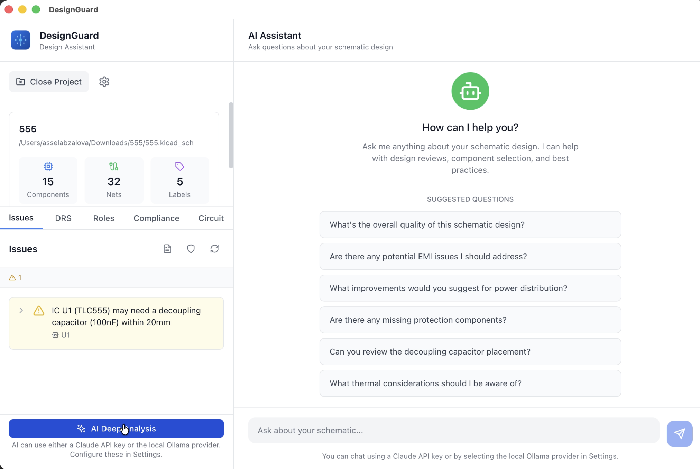

# DesignGuard

Pre-flight checks for KiCAD PCB designs. Catch electrical errors before manufacturing.

DesignGuard is a desktop app that analyzes your KiCad schematics and PCB layouts, flags potential issues, and explains what to fix. Think of it as a spell-checker for hardware design: it catches missing decoupling caps, I2C without pull-ups, undersized traces, and dozens of other mistakes before they become expensive manufacturing re-spins.



---

## Who is this for?

- **Hardware engineers** who want a second pair of eyes on KiCad designs
- **Hobbyists** learning PCB design and avoiding common pitfalls
- **Teams** who want automated checks alongside manual review

---

## Features

| Feature | What it does |
|--------|---------------|
| **Decoupling capacitor validation** | Checks that ICs have a nearby bypass capacitor (e.g. 100nF). Missing or poorly placed caps cause power-supply noise and can crash microcontrollers. |
| **Trace width calculator** | Computes minimum trace width for a given current using IPC-2221. Prevents traces from overheating or burning. |
| **IPC-2221 design rules** | Validates current capacity, via sizing, and clearances against the IPC standard. |
| **EMI/EMC checks** | Flags plane gaps, parallel trace crosstalk, and missing return vias that can cause EMI issues. |
| **Schematic DRC** | Catches I2C without pull-ups, crystals without load capacitors, unprotected USB/Ethernet, and power pins left unconnected. |
| **Built-in datasheet rules** | Cross-checks components against datasheet requirements for STM32, ESP32, RP2040, ATmega328P, LM1117, NE555, and more. You can also upload custom JSON datasheets. |
| **Decoupling Risk Score (DRS)** | Scores each IC 0 to 100 based on capacitor placement and routing. Helps prioritize which decoupling needs improvement. |
| **Optional AI analysis** | Uses Claude (cloud) or Ollama (local) for design review and component classification. Fully optional; the app works offline without AI. |

---

## Supported file formats

DesignGuard supports **KiCad 4 through 9**:

| Format | Extensions | Notes |
|--------|------------|-------|
| Modern schematic | `.kicad_sch` | KiCad 6+ |
| Modern PCB | `.kicad_pcb` | KiCad 6+ |
| Legacy schematic | `.sch` | KiCad 4 to 5 |
| Legacy PCB | `.brd` | KiCad 4 to 5 |

---

## Installation

### Windows
Download the `.exe` installer from [Releases](https://github.com/ltwmori/designGuardDesktopApp/releases) and run it.

### macOS
Download the `.dmg` from [Releases](https://github.com/ltwmori/designGuardDesktopApp/releases), open it, and drag DesignGuard to Applications.

### Linux
Download `.AppImage` or `.deb` from [Releases](https://github.com/ltwmori/designGuardDesktopApp/releases). For AppImage, make it executable and run it.

---

## Usage

1. **Open DesignGuard:** launch the app.
2. **Load your project:** click "Open Project" and select a `.kicad_sch` or `.kicad_pro` file. DesignGuard parses the schematic (and PCB if present).
3. **Run validation:** click "Run DRC" or "Run Validation" in the Issues tab. The app runs all enabled checks.
4. **Review results:** each issue shows severity (Error / Warning / Info), component reference, and an explanation of what’s wrong and how to fix it.
5. **Fix in KiCad:** address the issues in your schematic or PCB, then re-run validation to confirm.

You can also use the **DRS**, **Compliance**, and **Circuit** tabs for decoupling risk, PCB rules, and connectivity analysis. The **Chat** panel supports optional AI-assisted design review.

---

## Building from Source

### Prerequisites

- **Rust** (latest stable). [Install via rustup](https://rustup.rs/)
- **Node.js 18+** and npm
- **Tauri v2 system deps.** [Platform-specific setup](https://v2.tauri.app/start/prerequisites/)

### Commands

```bash
# Clone repository
git clone https://github.com/ltwmori/designGuardDesktopApp.git
cd designGuardDesktopApp

# Install dependencies
npm install

# Run in development (hot reload)
npm run tauri dev

# Build production binary
npm run tauri build
```

Built artifacts appear in `src-tauri/target/release/` (or `target/debug/` for dev builds).

---

## Optional: AI analysis

DesignGuard works fully without AI. If you want AI-assisted design review:

- **Claude (cloud):** Set your Anthropic API key in Settings. Requires internet.
- **Ollama (local):** [Install Ollama](https://ollama.ai/), run `ollama pull phi3`, and configure the Ollama URL in Settings (default `http://localhost:11434`). Works offline.

---

## Technology Stack

- **Frontend:** React, TypeScript, Tailwind CSS
- **Backend:** Rust (Tauri v2)
- **AI:** Claude API (Anthropic) and Ollama (local Phi-3)
- **Component data:** Built-in datasheet JSON + user-uploaded JSON

For architecture details and algorithm documentation, see [ARCHITECTURE.md](ARCHITECTURE.md).

---

## Contributing

Contributions are welcome. The easiest way to get started is adding a new design rule. See [CONTRIBUTING.md](CONTRIBUTING.md) for a step-by-step tutorial.

---

## License

MIT License. See [LICENSE](LICENSE)

---

## Roadmap

- [ ] Multi-board project support
- [ ] Custom rule definitions (JSON)
- [ ] PCB layout validation
- [ ] CI/CD integration

---

## Support

- 🐛 [Report bugs](https://github.com/ltwmori/designGuardDesktopApp/issues)
- 💡 [Request features](https://github.com/ltwmori/designGuardDesktopApp/issues)
